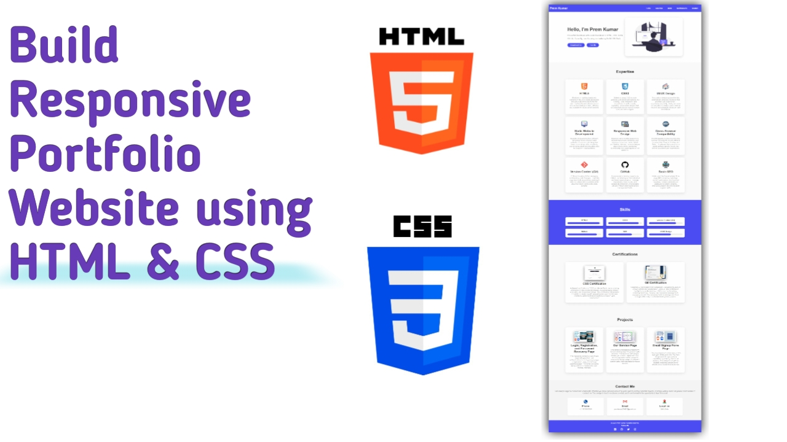

# Personal Portfolio

Welcome to my personal portfolio website! This project showcases my skills, experience, and projects in web development. The site is designed using **HTML** and **CSS**, and it is fully responsive across various devices.

## Demo Screenshot

## Live Demo

- You can check out the live demo of the [Personal Portfolio]()

## Table of Contents

- [Features](#features)
- [Technologies Used](#technologies-used)
- [Contributing](#contributing)
- [Contact](#contact)

## Features

- **Responsive Design**: Fully responsive for mobile, tablet, and desktop screens.
- **Smooth Animations**: Subtle hover and button animations for an enhanced user experience.
- **Sticky Navigation Bar**: The navigation bar sticks to the top while scrolling.
- **Skill Progress Bars**: Visual representation of my proficiency in various tools.
- **Projects Showcase**: A collection of my projects with descriptions and links to GitHub repositories.
- **Certifications Section**: Display of my certifications with details and visuals.
- **Contact Section**: Ways to get in touch with me via email and social media links.

## Technologies Used

- **HTML5**: For structuring the content of the web pages.
- **CSS3**: For styling, layout, and responsiveness.

## Contributing

Contributions are welcome! Please feel free to submit a pull request or open an issue for any suggestions or improvements.

## Contact

For any questions or comments, please reach out to :

- Email : [premkumar224487@gmail.com](mailto:premkumar224487@gmail.com)
- Github : [premkrrajbhar](https://github.com/premkrrajbhar)
